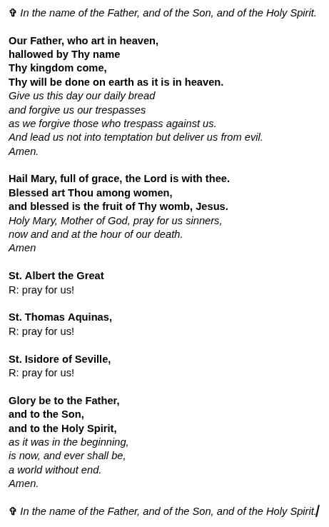
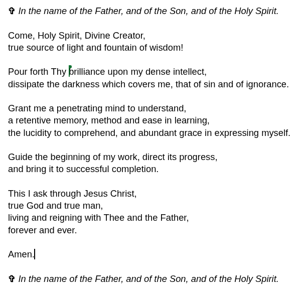

#+TITLE:Agenda - Intro to Programming (Python)
#+AUTHOR:Marcus Marcus Birkenkrahe
#+SUBTITLE:CS CS 100, Catholic Polytechnic University
#+STARTUP: overview hideblocks indent entitiespretty:
#+attr_html: :width 600px :float nil:
[[../img/breughel_babel_1563.jpg]]
* Prayers
** Opening Prayer (Standard)
#+attr_html: :width 550px :float nil:

** Closing Prayer (Aquinas)
#+attr_html: :width 550px :float nil:

** Why these prayers?

- *The "Our Father"*, because we learn everything through him.
- *The "Hail Mary"*, because we need trust and humility to learn.
- *St. Albert the Great*, because he is the patron saint of scientists,
  philosophers, and students of the natural sciences.
- *St. Thomas Aquinas*, because he is the patron saint of Catholic
  schools, universities, and scholars.
- *St. Isidore of Seville*, because he is the patron saint of students,
  scholars, the internet, computer users and encyclopedias.
- *A student's prayer* is by St. Thomas Aquinas.

* DONE Week 1 - Overview and Getting Started with Python in Colab

- [X] Opening prayer
- [X] About your instructor
- [X] Syllabus walk-through
- [X] Course infrastructure
- [X] Assigned reading
- [X] Class workflow
- [X] Programming assignments
- [X] DataCamp assignments and walk-through
- [X] Getting started with Colab
- [X] Next assignments
- [X] Wrap-up
- [X] Closing prayer

** About your instructor

- Google me or ask AI.

- Ask me about anything you'd like to know.

** Syllabus walk-through

- Where can you find the syllabus?
  #+begin_quote
  You find the syllabus in Teams > General (main channel)
  #+end_quote

- What does your grade depend on?
  #+begin_quote
  Your grade depends on weekly online lessons, programming
  assignments, multiple-choice quizzes, and monthly mini-projects.
  #+end_quote

- What's new in this course?
  #+begin_quote
  + This is the first time that I'm using this textbook by Downey.
  + This is the first time that I'm assigning reading every week.
  + This is the first time that I'm asking you to do projects.
  + This is the first time that I have taught CS100 online.
  #+end_quote

- What about AI? -> birkenkrahe.github.io
  #+begin_quote
  Use of AI is permitted and encouraged, with an important caveat: You
  must be able to explain your code to the last detail.
  #+end_quote

- How much time will you have to invest per week?
  #+begin_quote
  1) 90 minutes class meeting (this)
  2) 90 minutes asynchronous lesson & practice (DataCamp)
  3) 2 hours for quizzes and programming assignments
  4) 1 hour for reading/working through the online notebooks/textbook

  ...or about 1 hour per day every week (except Sunday).
  #+end_quote

** Course infrastructure

- [X] MS Teams -> assignments, quiz, recordings, chat, grades
- [X] GitHub -> class materials
- [X] Google Colaboratory -> Jupyter notebooks

** Assigned reading

- You will be assigned one chapter per week of "Think Python" (3e) by
  Allen B. Downey ([[https://github.com/TVsony/Complete-Python/blob/master/Think%20Python%20third%20Edition.pdf][PDF]])

- The book is free: [[https://allendowney.github.io/ThinkPython/][allendowney.github.io/ThinkPython/]], and it comes
  with Colab notebooks, which means that you can run all code online.

- For each assigned chapter, you are expected to:
  1. *Read* the text sections +carefully+ +(do not skim)+.
  2. *Copy* the notebook so that you can edit it.
  3. *Run *all* code cells in the corresponding notebook.
  4. *Modify* examples to test your understanding.
  5. *Take notes* on anything that is unclear.
  6. Keep your notes in your notebook where the code is.
- Estimated time to completion: *60-90 minutes.*
- *Let's check out the first chapter to see what you're up against.*

** Class workflow

- Class time will *not* repeat the notebook content line-by-line.

- Each session will (usually) include:
  1. An opening prayer
  2. A short review of what we did the last session.
  3. A little coding to warm up the engines.
  4. Some new concepts (or more on some old concepts).
  5. Code along with me!
  6. Practice the new concepts by solving an exercise.
  7. A wrap-up to find out what you learnt.
  8. A closing prayer.

- You are expected to arrive having:
  + Opened the notebook for the assigned textbook chapter
  + Run the code at least once and read the chapter
  + Identified at least one question or confusion

** Programming Assignments

- Weekly programming assignments are based on the textbook.

- For each chapter, you will submit your own notebook with:
  + 3–5 short written answers (explanations or predictions)
  + 2–3 modified code examples (not identical to the notebook)

- Typical required actions include:
  + Predicting output before running code
  + Modifying expressions and explaining the result
  + Creating and fixing simple errors

- Estimated time per assignment:
  + 45–60 minutes for most students

- Assignments are graded for:
  + Completion of required tasks
  + Evidence of engagement (not copy/paste)

- The assignments are often co-developed with AI

** DataCamp assignments & walk-through

- You will complete one DataCamp lesson per week.

- Timeframes are given (e.g. 1-4 hours) but actual time varies.

- When working carefully—running code outside the platform, testing
  variations, or researching errors—you should expect:~60–90 minutes
  per lesson.

- To get full value from DataCamp, you are expected to:
  + Complete all exercises (not skip or guess)
  + Re-run key examples outside the platform (e.g., Colab or local
    Python)
  + Experiment with small modifications
  + Look up unfamiliar concepts or errors

- DataCamp is used to:
  + Reinforce syntax and patterns
  + Provide additional guided practice
  + Build fluency through repetition

** Getting started with Python Colab

- You'll learn Python through a form of "literate programming"
  with *Jupyter notebooks* = text + Python code + output

- Open colab.research.google.com in your browser

- Now, open [[https://is.gd/6nAJtZ][is.gd/6nAJtZ]] and code along with me.

- The full script with detailed annotations, is in GitHub:
  1. As a PDF (=.pdf=) or an Org-mode (=.org=) file to read
  2. As a Colab notebook (=.ipynb=) to run

- To open GitHub, go to: [[https://github.com/birkenkrahe/cs100][github.com/birkenkrahe/cs100]]

** Next Assignments

You will get one message from me per week in the ~General~ Teams
channel. Please read it carefully and get back to me with questions!

*Mandatory:*

1. *Read* chapter 1, "Programming as a Way of Thinking" (pp. 1-10).

2. *Complete* lesson 1, "Python Basics" of the DataCamp course
   "Introduction to Python" (1.5 hours available)

3. *Complete* a multiple choice quiz on the course rules and the Colab +
   Python demo.

*Optional*:

4. *Bonus assignment:* Abortion statistics in the US.

5. *Play* through the Colab notebook for chapter 1
   ([[https://tinyurl.com/downey-chap01-ipynb][tinyurl.com/downey-chap01-ipynb]]). It contains the text, too.

- You can interact with an *"AI Coach"* while watching the videos.

- Estimated time for reading + online lesson: at least 2.5 hours.

- There will be a *weekly quiz* to check your understanding.

- The *first quiz* will test DataCamp ch 1 and Think Python ch 1.

- The *deadline* for the first quiz is June 5.

- There will be no class on June 5th (I will record a session).

** Wrap up

- Google Colab notebooks runs on LinuxVM
- Programming is getting the machine to do what you want it to do (for
  that to work, you need to know how the machine sees what you see)
- Using markdown and making Python plots
- Python is easier to learn than Java
- Python is good for scientific computing (using math functions)
- New vocabulary

* DONE Week 2 - Programming as a way of thinking (chapter 1)

- [X] *Opening prayer*
- [X] *Info:* Changes to the Teams dashboard
- [X] *Review:* What did you achieve this week?
- [X] *Review:* Code along as I explore Pythagoras' theorem
- [X] *Info:* Next week (June 5th) there will be *no class meeting*
- [X] *New assignments* for the next two weeks: reading + quiz + code
- [X] *Closing prayer*

** Opening prayer (Ps 126 + Our Father)

#+begin_quote
Unless the Lord build the house,
they labour in vain that build it.
Unless the Lord keep the city,
he watcheth in vain that keepeth it."
— Psalm 126:1,

---

*Our Father, who art in heaven,*
*hallowed be Thy name,*
*Thy kingdom come,*
*Thy will be done*
*on Earth as it is in heaven.*

Give us this day our daily bread
and forgive us our trespasses,
as we forgive those who trespass against us,
and lead us not into temptation,
but deliver us from evil.

Amen.
#+end_quote
** Review: Textbook chapter 1 "Programming as a way of thinking" (5')

- Did you read it? How? Interactive or reading only?
- What did you think of it?
- Did you do any of the exercises yet?
- What do you think about the title of the textbook chapter?

Content:
- Arithmetic operators - standard and special
- Arithmetic functions - ~round(), ~abs()~
- Strings and string functions - ~str()~, ~len()~
- Values and types - ~type()~, ~int()~, ~float()~
- Formal vs. natural languages
- Debugging
- Exercises
- Glossary

*Next*:
- Chapter 2, Variables and Statements (May 29 - June 5)
- Chapter 3, Functions (June 5 - June 12)

** Review: DataCamp "Intro to Python" lesson 1 "Python Basics" (5')
#+attr_html: :width 600px :float nil:
[[../img/datalab.png]]

- How did you work through the lesson? Any questions?
- Did you try the datalab workbook? (Jupyter notebook like Colab)
- Did you do a practice exercise (nice way to keep streak fresh)?
- Did you check out any other DataCamp courses?

Content:
- Printing to the display
- Python as a calculator
- Variables and types
- Variable assignment
- Calculations with variables

** Warm up coding (in Colab)

- Open the starter code in Colab: [[https://tinyurl.com/arithmetic-starter][tinyurl.com/arithmetic-starter]]

- Copy the file to your GDrive to be able to edit it

- Solve the exercises on your own (no AI), then let's compare

- The last two exercises are given as a bonus assignment for home

- There is another bonus assignment with tricky formulas,
  "Formula translator" (graded)

** Code along: Pythagoras in Python

- Open the starter code in Colab: [[https://tinyurl.com/pythagoras-python][tinyurl.com/pythagoras-python]]

- Copy the file to your GDrive to be able to edit it

- Code along with me and ask questions along the way

- Your programming assignment this week ("Pay stub") is very similar

** New assignments

*Week 2: May 29-June 5*

1. *Submit* quiz 2
2. *Complete* and submit a home programming assignment
3. *Read* chapter 2 of the textbook, "Variables and statements"
4. *Complete* lesson 2 of the DataCamp course "Python lists"

*Week 3: June 5-June 12*

1. *Submit* quiz 3
2. *Complete* and submit a home programming assignment
3. *Read* chapter 3 of the textbook, "Functions"
4. *Complete* lesson 3 of the DataCamp course "Functions and packages"

** Wrap-up

- Pseudocode RULES
- Variable separators
- Limit the number of operations in your code
- Rounding numbers
- Pythagoras believed the number was the fabric of the universe
- He was wrong, it's the WORD! (Not Microsoft)

** Closing Prayer (1 Cor 13:11-12 + Hail Mary)

#+begin_quote
When I was a child, I spoke as a child,
I understood as a child, I thought as a child.
But, when I became a man,
I put away the things of a child.

We see now through a glass in a dark manner;
but then face to face. Now I know in part;
but then I shall know even as I am known."
— 1 Cor 13:11-12

---

*Hail Mary, full of grace,*
*the Lord is with Thee.*
*Blessed art Though among women*
*and blessed is the fruit of Thy womb, Jesus.*

Holy Mary, Mother of God,
pray for us sinners,
now and in the our of our death.

Amen.
#+end_quote

* DONE Week 3 - [Moving] Variables & Types (chapter 2)
* DONE Week 4 - Solemnity of the Sacred Heart of Jesus / Functions and Packages
** Plan

| Activity                                     | Min |   |
|----------------------------------------------+-----+---|
| Opening prayer                               |   1 | x |
| Projects intro (proposal)                    |   5 | x |
| Review: Quiz 2 (Python basics)               |   5 | x |
| Review: Paystub solution                     |   5 | x |
| Review: Quiz 3 (variables and statements)    |   5 | x |
| Review: Programming assignment (sphere/trig) |   5 | x |
| Review: Python lists                         |   5 | x |
| Variables & Statements (extension)           |  10 | x |
| Warm-up: Euler's number (code-along)         |  10 | x |
| Functions: Anatomy of a function             |  10 | x |
| Functions: Traceback → pythontutor.com       |  10 | x |
| Packages: NumPy preview                      |  10 |   |
| Next assignments                             |   3 | x |
| Checkout (takeaway)                          |   1 | x |
| Closing prayer                               |   1 | x |
|----------------------------------------------+-----+---|

** Opening prayer

[[../img/memorare_to_the_Sacred_Heart_of_Jesus.png]]

** Projects (midterm/final)

- 20% of your grade comes from two projects one at midterm, one before
  the end.

- The first project (due in week 7 - July 3rd)

- Project ideas:

  1) Pick a Python package, like ~matplotlib~ or ~numpy~, ~pandas~, ~seaborn~,
     or another package interesting to what you know already, study
     the documentation, and create a Colab notebook that illustrates a
     use case.

     Examples: Visualize a personal dataset (grades, sleep log,...);
     pull data from a public API (weather, Bible verse, sports scores)
     and process the response. If you work in finance or pet care,
     look for Python packages used in these domains.

  2) Write an application of your choice - a small standalone program
     (single file) that does something useful. Build/document in
     a Colab notebook.

     Examples: Password generator, number- or word guessing game,
     simple text based adventure game, unit converter, quiz game
     pulling questions from a file, full song generator.

- The final capstone project will be just like this but you'll have
  more tools available and can (hopefully) built better stuff.

- It is perfectly OK if you use AI to help you do this. But you need
  to be able to present, demonstrate and explain your result.

- Next milestone: Sketch a proposal by next week:
  1) Rationale - What do you want to do?
  2) References - What will you be looking for?
  3) Results - What do you expect to get out of this?
  4) Risks - What could go wrong?

- Submit a prototype by the end of week 7 (July 3rd). Attach a file or
  a link to a GDocs file, or write your proposal in the text field.

- Estimated time: 1 hr for the proposal, 4-6 hours for the prototype
  (spread out over 3 weeks).

** Caveat

Don't believe everything you read[fn:1]:
#+begin_quote
"Programming, and especially debugging, sometimes brings out strong
emotions. If you are struggling with a difficult bug, you might feel
angry, sad, or embarrassed." Downey (ch 1)
#+end_quote

** Review: Quiz / Assignments
*** Submission rules

- For all URL uploads, you need to *share* the Colab file with *anyone
  who has the link* so that I can grade it!

- If you submit late, you can get 50% of the points if turned in by
  August 28, 2026, for both quizzes and programming assignments.

- The quizzes assume that you have either read the respective chapter
  in the textbook or (better) clicked your way through the notebook.

*** Quiz 2 (Python basics)

1. What does ='Well, ' + "it's a small " + 'world.'= produce?

   Not entirely fair because the console (on the terminal) and Colab
   (notebook) generate different answers:

   #+begin_example python
   >>> 'Well, ' + "it's a small " + 'world.'
   "Well, it's a small world."
   #+end_example

   #+attr_html: :width 350px :float nil:
   [[../img/smallworld.png]]

   (I have made a note for the three who were robbed of one point.)

2. What's the difference between "compile-time" and "run-time"?
   #+begin_quote
   *Compile-time:* when Python translates your (human-readable) source
   code into bytecode, before any of it runs.

   *Run-time:* when the Python interpreter executes that bytecode, line
   by line.

   All errors are called "bugs."

   *Compile-time* errors prevent the program from starting at all — the
   main one you'll encounter is ~SyntaxError~ (including
   ~IndentationError~).

   *Run-time* errors are called "exceptions" — they occur only when the
   offending line is executed, and can be guarded against with
   ~try~/~except~. Examples: ~NameError~, ~ZeroDivisionError~, ~TypeError~.

   Because Python checks syntax before running anything, ~SyntaxError~
   is usually caught immediately and points directly at the problem.
   Run-time exceptions are often trickier — they may only surface when
   a particular branch or input triggers them.

   If you haven't done it yet, check "A Gallery of Errors" ([[https://github.com/birkenkrahe/cs100/blob/main/org/2_pythagorean.org#step-10-a-gallery-of-errors][GitHub]]).
   #+end_quote

3. All other mistakes seemed to be the result of someone not running a
   command to check the answer: *Don't guess, but code and experiment!*

If you got (1) wrong, you get an extra point. Everybody gets an extra
point for (2). Unfortunately, I cannot add points to the gradebook, so
this will have to be done at the end of the term if you need it.

*** Programming assignment: Paystub calculator

- A solution is available at [[https://tinyurl.com/paystub-solution][tinyurl.com/paystub-solution]]

- Any questions on this assignment?

*** Quiz 3 (variables and statements)

- A student writes =primt("hello")= - what type of error is this?
  #+attr_html: :width 600px :float nil:
  [[../img/quiz_3_question_28.png]]

  This is a *runtime error* (more specifically a ~NameError~):
  #+begin_src bash :results output :exports both
    python3 -c 'primt("hello")' 2>&1
  #+end_src

  #+RESULTS:
  : Traceback (most recent call last):
  :   File "<string>", line 1, in <module>
  : NameError: name 'primt' is not defined. Did you mean: 'print'?

*** Programming assignment

- Part 1: compute the volume of a sphere given its radius.
  #+attr_html: :width 400px :float nil:
  [[../img/volume-sphere.png]]

- Part 2: confirm the trig version of Pythagoras' theorem.
  #+attr_html: :width 400px :float nil:
  [[../img/unit_circle.png]]

*** DataCamp - Python lists (reference and copy)

- Python lists: mutable, ordered, heterogenous sequence.
  #+begin_src python :results output :exports both :session *Python* :python python3

  #+end_src

- A list name is a reference:
  #+begin_src python :results output :exports both :session *Python* :python python3

  #+end_src

- A real copy of a list involves new memory allocation:
  #+begin_src python :results output :exports both :session *Python* :python python3

  #+end_src

** Variables and Statements (extension)

- What happens when a number is assigned to a variable: =n = 17= ?
  #+begin_quote
  + Python evaluates the expression on the right (=17=) creating an
    integer object with that value.
  + The name =n= is bound to that object. It can now be referenced as =n=.
  #+end_quote

- Is =n= now stuck with =17=?
  #+begin_quote
  + =n= is an entry in a namespace pointing to whatever object was last
    bound to it.
  + Rebinding it does not touch the object =17= at all, it just makes =n=
    point elsewhere.
  + No type is associated with the name =n=.
  #+end_quote

- Code example:
  #+begin_src python :results output :exports both :session *Python* :python python3
    n = 17
    print(n)
    n = "seventeen"
    print(n)
  #+end_src

- Python variables are like *sticky notes*, not boxes.

- What happens when you print a variable =n=: =print(n)= ?
  #+begin_quote
  1) Name lookup: Python looks up =n= in the current namespace
  2) It finds the object it is bound to (e.g. the ~int~ object =17=)
  3) ~print()~ receives a reference to that object
  4) ~print()~ calls ~str()~ on the object: =str(17) -> '17'=
  5) Resulting string is written to ~sys.stdout~ followed by a newline
  #+end_quote

- ~print()~ as a function returns ~None~:
  #+begin_src python :results output :exports both :session *Python* :python python3
    x = print(n)
    print(x)
  #+end_src

** PRACTICE Warm up practice: Compute Euler's number (~e~)

Open colab.research.google.com.

In Colab, open ~Tools > Setting~ and check ~Use a temporary scratch
notebook as the default landing page.~ Then =Save=.

Now open colab.research.google.com again or refresh the page to code
along if you like.

- Euler's number e is also defined in the ~math~ module. e is the basis
  of the natural logarithm: ln(e) = 1:
  #+begin_src python :results output :exports both :session *Python* :python python3

  #+end_src

  #+RESULTS:
  : 1.0

- Compute e three ways:
  1. use ~math.e~ and the exponentiation operator ~**~
  2. use ~math.pow()~ to raise ~math.e~ to the power 2
  3. use ~mat.exp()~ which takes an argument x, and compute e^{x}

  #+begin_src python :results output :exports both :session *Python* :python python3
    # exp.py: compute e^2 in three different ways | Author: Marcus
    # Birkenkrahe | Source: Downey, Think Python (3e), ch 2

    # import math

    # use math.e and the exponentiation operator **

    # use math.pow() to raise math.e to the power 2

    # use mat.exp() which takes an argument x, and compute e^{x}

  #+end_src

  - Which of these is correct?
    #+begin_quote
    ~math.e~ already carries a small rounding error (truncated to 64-bit
    float representation). This error is compounded through squaring.

    ~math.exp(2)~ computes e^{2} directly via a dedicated algorithm,
    correctly rounded to the nearest value to the true mathematical
    value. It never uses the constant ~math.e~.

    *Rule*: When a closed-form function exists for what you want (exp,
    log, sqrt, etc.) prefer it over composing more primitive
    operations both for accuracy and speed.
    #+end_quote

  - Demonstrating that with the ~mpmath~ package (and f-string output):
    #+begin_src python :results output :exports both :session *Python* :python python3

    #+end_src

** PRACTICE User-defined functions and Packages (extension and practice)

- Step 1: Anatomy of a function
- Step 2: Traceback and Pythontutor.com
- Step 3: NumPy preview

Open the Colab starter notebook:
[[https://tinyurl.com/functions-packages-starter][tinyurl.com/functions-packages-starter]]

Complete notebook:
[[https://tinyurl.com/functions-packages-complete][tinyurl.com/functions-packages-complete]]

** Next assignments (June 19th)

- Submit informal project proposal for your midterm project.

- DataCamp chapter on "NumPy" (deadline June 26 - 2 weeks time).

- Quiz 4 on DataCamp and textbook content (functions/packages).

- Simple home programming assignment on functions and packages.

- Read/work through "Functions and Interfaces" (chapter 4 of the
  textbook with a Colab notebook). This is fun: graphics!

As always for the textbook assignments, the best way is to either read
the book and/or play through the Colab notebook - 30 minutes tops (not
counting the exercises).

** Closing prayer

[[../img/o_most_holy_heart_of_jesus.png]]

* DONE Week 5 - Interface and Implementation / ~JupyTurtle~ graphics

| Activity                           | Min |   |
|------------------------------------+-----+---|
| Opening prayer                     |   1 | x |
| Update: Current assignments        |   5 | x |
| Projects: Review of your proposals |  15 | x |
| Interface design                   |  60 | x |
| Next assignments                   |   5 | x |
| Checkout (takeaway)                |   5 | x |
| Closing prayer                     |   1 | x |
|------------------------------------+-----+---|

** Opening prayer

[[../img/memorare_to_the_Sacred_Heart_of_Jesus.png]]

** Update

- I added one bonus assignment "Five easy pieces"
- I added one programming assignment "Simple function exercises"
- I added grading categories and weights
- Bonus assignments are now listed as 0 points - added at end

#+begin_src python :results output :exports both :session *Python* :python python3
  [print(_) for _ in dir(list)]
#+end_src

#+RESULTS:
#+begin_example
__add__
__class__
__class_getitem__
__contains__
__delattr__
__delitem__
__dir__
__doc__
__eq__
__format__
__ge__
__getattribute__
__getitem__
__gt__
__hash__
__iadd__
__imul__
__init__
__init_subclass__
__iter__
__le__
__len__
__lt__
__mul__
__ne__
__new__
__reduce__
__reduce_ex__
__repr__
__reversed__
__rmul__
__setattr__
__setitem__
__sizeof__
__str__
__subclasshook__
append
clear
copy
count
extend
index
insert
pop
remove
reverse
sort
#+end_example

#+begin_src python :results output :exports both :session *Python* :python python3
  l = [1,2,"jim"]
  l.clear()
  print(l)
  help(len)
  help(list.remove)
#+end_src

#+RESULTS:
#+begin_example
[]
Help on built-in function len in module builtins:

len(obj, /)
    Return the number of items in a container.

Help on method_descriptor:

remove(self, value, /)
    Remove first occurrence of value.

    Raises ValueError if the value is not present.
#+end_example

** Projects: Review of your proposals

- Tell us about your project!
- I will give everyone individual feedback.
- Did you answer to the assignment requirements?
- Did you provide sources? (Included software?)
- How much time did you spend?
- What's your confidence index? (0-10)
- Do you have any questions?
- Ask any questions in the General messages or via chat

** Review: Functions and Interfaces (ch 4)

- Summarize what you took away from this chapter?

  #+begin_quote
  - *Encapsulation* — wrap repeated code into a named function
    (e.g. =square()=)
  - *Generalization* — replace a magic number with a parameter
    (e.g. =square() → square(length)=)
  - *Interface vs. implementation* — the caller needs to know what a
    function does and what to pass it, not how it works inside
    (e.g. calling =polygon(t, n, length)= without knowing the angle
    math)
  - *Refactoring* — improving a function's design after it already
    works, without changing what it does
  - *Development plan* — encapsulate, then generalize, then refactor: a
    repeatable process, not a one-shot
  - Begin with the simplest version of your problem -> add functionality
    -> now you will begin to need function -> generalize -> refactoring
  - *Process* becomes *workflow* when you control the development
  - *Magic numbers* — unexplained literal values in code that should
    usually become parameters or named constants
  #+end_quote

#+begin_src python :results output :exports both :session *Python* :python python3
  print("Marcus" + " B") # print needs 0 or n arguments
#+end_src

#+RESULTS:
: Marcus B

** PRACTICE Interface design: Rosary

- Open the Colab notebook: [[https://tinyurl.com/rosary-starter][tinyurl.com/rosary-starter]]
- Make a copy
- Code along with me

** Next assignments

- Quiz on this week's content
- Home programming assignment: "Full rosary!" (Refactoring)
- DataCamp lesson on "NumPy" due
- Read/work through chapter 5 of the textbook (Conditionals)
- Remember midterm project is due on Friday, July 3rd

** Take aways

- Encapsulation
- Functions that share no logic don't need to be bundled
- Rosary as a composition of functions
- Coding for Catholics
- Generalize by turning numbers into parameters
- Change by degree (does not touch logic) vs. by kind (algorithm)

** Closing prayer

[[../img/o_most_holy_heart_of_jesus.png]]

* DONE Week 6 - Conditionals and Recursion / NumPy

| Activity                           | Min |   |       |
|------------------------------------+-----+---+-------|
| Opening prayer                     |   1 | x |       |
| Post-mortem: ~remove~ vs ~len~ vs ~del~  |   5 | x |       |
| Projects: Review (proposals)       |   5 | x |       |
| Review: Chapter 5 / DataCamp NumPy |  35 | x |       |
| Code along: Liturgical Prayers     |  35 | x | video |
| Next assignments                   |   1 | x |       |
| Checkout (takeaway)                |   5 | x |       |
| Closing prayer                     |   1 | x |       |
|------------------------------------+-----+---+-------|

** Opening prayer

[[../img/memorare_to_the_Sacred_Heart_of_Jesus.png]]

** Update - housekeeping

- All remaining DataCamp lessons assigned (July 3-Aug 28):
  1) Intermediate Python: Pandas, dictionaries, loops, control flow
  2) Lambda functions and error-handling 
  3) Python Toolbox: iterators, comprehensions, generators

- All assignments and quizzes until June 19 graded.

- If you submitted and have 0 points: Share your submission.

** Post-mortem: Three ways Python lets you act on a list

TLDR version:

Restated more precisely, the question is:
#+begin_quote
~list~ has ~.remove()~ as a method - isn't ~len~ also a method, and why is
~del~ neither a method nore a function but something else entirely?
#+end_quote

1. ~x.remove()~ is a *method* that belongs to the ~list~ type and you call
   it with the dot-notation.
   
2. ~len()~ is a *function*, an interface to the hidden function ~__len__~
   and works for all objects that chose to implement length counting.
   
3. ~del~ is a built-in *keyword* that works on any object using the hidden
   ~__delitem__~ function.

These three represent three levels of operations of different
impact. The language could also have one function for everything, but
the price of giving up this abstraction would be much duplication and
waste of resources.

Full version [[https://teams.cloud.microsoft/l/message/19:xwJm5Zf90mdM34VuFWBGyX-ofNKhU9JQ7Wbrr55uYSE1@thread.tacv2/1781961912939?tenantId=0a354b0e-92d3-45a0-8b54-df786cb36e0f&groupId=10bc88e3-971f-4b60-ae54-c90368bd6d8c&parentMessageId=1781961912939&teamName=CS%20100&channelName=General%20messages&createdTime=1781961912939][posted to General Messages, 6/20/2026]]

** Project review: Proposals feedback

- Keep it simple, keep it stupid.
- The purpose is the (well-documented) journey.
- You need to provide your sources.
- You need to own up to your specific use of AI.
- To share: ways to work locally with Python and Jupyter

** Review: Refactoring assignment

- What was the last session about (apart from the Rosary :-)?
  #+begin_quote
  1. *Interface design* involves writing functions that *encapsulate*
     algorithms (= steps to take to solve a problem)
  2. When a function contains variable or constant numbers, it can be
     *generalized* by replacing the numbers with variables that become
     parameters of the function.
  3. The user calls functions with (or without) arguments based on his
     knowledge of the *interface* (function name and parameters).
  4. The function body contains the *implementation*, and the user does
     not need to know about anything except the interface.
  5. When a program with multiple functions works, it can often be
     optimized by *refactoring* - restructuring existing working code to
     reduce duplication and improve reuse, without changing what the
     program does.
  #+end_quote

- The working code (test for n=1):
  #+begin_src python :results output :exports both :session *Python* :python python3
    # Functions definitions
    def our_father():
      """Print the first line of Our Father.
      """
      print("Our Father, who art in heaven...")

    def hail_mary():
      """Print the first line of the Hail Mary
           """
      print("Hail Mary, full of grace...")

    def fatima():
      """Print the first line of the Fatima prayer
           """
      print("O my Jesus, forgive us our sins...")

    def glory_be():
      """Print the first line of the Glory Be
           """
      print("Glory be to the Father...")

    def decade(mystery, n=10):
      """Pray one decade of the rosary.

         mystery: string, the name of the mystery to announce
           n: int, number of Hail Marys (default 10 for full decade)
           """
      print(mystery)
      our_father()
      for i in range(n):
        hail_mary()
      glory_be()
      fatima()

    def rosary(mysteries):
      """Pray one set of five decades of the Rosary.

         mysteries: list of 5 strings, one mystery name per decade
      """
      for mystery in mysteries:
        decade(mystery,n=1)

    # main program
    def main():
      # Sorrowful mystery:
      sorrowful = [
        "The First Sorrowful Mystery: The Agony in the Garden",
        "The Second Sorrowful Mystery: The Scourging at the Pillar",
        "The Third Sorrowful Mystery: The Crowning with Thorns",
        "The Fourth Sorrowful Mystery: The Carrying of the Cross",
        "The Fifth Sorrowful Mystery: The Crucifixion and Death of Jesus",
      ]

      # Pray the Sorrowful mystery:
      rosary(sorrowful)

    # main guard
    if __name__ == "__main__":
      main()
  #+end_src

  #+RESULTS:
  #+begin_example
  The First Sorrowful Mystery: The Agony in the Garden
  Our Father, who art in heaven...
  Hail Mary, full of grace...
  Glory be to the Father...
  O my Jesus, forgive us our sins...
  The Second Sorrowful Mystery: The Scourging at the Pillar
  Our Father, who art in heaven...
  Hail Mary, full of grace...
  Glory be to the Father...
  O my Jesus, forgive us our sins...
  The Third Sorrowful Mystery: The Crowning with Thorns
  Our Father, who art in heaven...
  Hail Mary, full of grace...
  Glory be to the Father...
  O my Jesus, forgive us our sins...
  The Fourth Sorrowful Mystery: The Carrying of the Cross
  Our Father, who art in heaven...
  Hail Mary, full of grace...
  Glory be to the Father...
  O my Jesus, forgive us our sins...
  The Fifth Sorrowful Mystery: The Crucifixion and Death of Jesus
  Our Father, who art in heaven...
  Hail Mary, full of grace...
  Glory be to the Father...
  O my Jesus, forgive us our sins...
  #+end_example

- The solution:
  1) Rewrite =rosary()= to accept a =mystery_name= parameter
  2) Add the remaining mysteries as lists
  3) Write =full_rosary()= as four calls to =rosary()=
     #+begin_example python
     def full_rosary():
         rosary2("--- The Joyful Mysteries ---", joyful)
         rosary2("--- The Sorrowful Mysteries ---", sorrowful)
         rosary2("--- The Glorious Mysteries ---", glorious)
         rosary2("--- The Luminous Mysteries ---", luminous)
     #+end_example
  4) Add the four mysteries as a list of two-element lists
  5) Rewrite =full_rosary()= as a loop over =rosary2()=
     #+begin_example python
     def full_rosary2():
         for pair in mysteries:
             rosary2(pair[0],pair[1])
     #+end_example

- If you did not manage to solve/submit this, try again, be extra
  verbose in your notebook, and submit for 50% of the points.

- We'll discuss the solution to the extension (with ~return~) next time
  because it is a good preparation for chapter 6 (functions with
  ~return~) - reading assignment for July 8 (not July 1).

** New Assignments

- *Quiz:* Conditionals, Recursion, NumPy.
- New DataCamp lesson ~matplotlib~ (creating graphs)
- *Work on your project* (deadline Friday July 3rd)
- *No new book chapter* assigned this week!

** Warm up coding: What's wrong with this code?

- Open this notebook and make a copy:
  [[https://tinyurl.com/conditionals-recursion-numpy][tinyurl.com/conditionals-recursion-numpy]]

- Let's review textbook and DataCamp content.

- Find out what's wrong with the code, then fix it.

- The solution is available on GitHub (review/ folder).

** Code along lecture: Liturgical Hours Revisited

- Objectives:
  1. Use =//= (integer division) and =%= (modulus) to extract components
     from a raw integer value (e.g. hours and minutes from seconds).
  2. Write a chained conditional (=if= / =elif= / =else=) to classify a
     value into one of several named categories.
  3. Apply =//= and =%= element-wise across a NumPy array.
  4. Construct a boolean mask from a NumPy array and use it to subset
     the array.
  5. Combine two boolean conditions on a NumPy array using =&=.

- Open the starter notebook and code along:
  [[https://tinyurl.com/liturgical-prayers-starter][tinyurl.com/liturgical-prayers-starter]]

- The solution notebook is available on GitHub.

** Take aways today?

- When recursion is valuable (you need a recursive problem)
- There is a modifiable system parameter for maximum recursion
- Fractals are exemplary recursive structures
- Guessing (or knowing) error codes (to build guardrails)

** Closing prayer

[[../img/o_most_holy_heart_of_jesus.png]]

* DONE Week 7 - Matplotlib - Midterm project 

** Opening prayer

LITANY OF THE MOST PRECIOUS BLOOD ([[https://www.usccb.org/prayers/litany-most-precious-blood][usccb.org]])

 Lord, have mercy  *Lord, have mercy*
 Christ, have mercy  *Christ, have mercy*
 Lord, have mercy  *Lord, hav mercy*
       
 God our Father in heaven  *Have mercy on us*
 God the Son, Redeemer of the world  *Have mercy on us*
 God the Holy Spirit  *Have mercy on us*
 Holy Trinity, one God  *Have mercy on us*
 
 Blood of Christ, only Son of the Father  *Be our salvation*
 Blood of Christ, incarnate Word  *Be our salvation*
 Blood of Christ, of the new and eternal covenant  *Be our salvation*
 Blood of Christ, that spilled to the ground  *Be our salvation*
 Blood of Christ, that flowed at the scourging  *Be our salvation*
 Blood of Christ, dripping from the thorns  *Be our salvation*
 Blood of Christ, shed on the cross  *Be our salvation*
 Blood of Christ, the price of our redemption  *Be our salvation*
 Blood of Christ, our only claim to pardon  *Be our salvation*
 Blood of Christ, our blessing cup  *Be our salvation*
 Blood of Christ, in which we are washed  *Be our salvation*
 Blood of Christ, torrent of mercy  *Be our salvation*
 Blood of Christ, that overcomes evil  *Be our salvation*
 Blood of Christ, strength of the martyrs  *Be our salvation*
 Blood of Christ, endurance of the saints  *Be our salvation*  
 Blood of Christ, that makes the barren fruitful  *Be our salvation*
 Blood of Christ, protection of the threatened  *Be our salvation*  
 Blood of Christ, comfort of the weary  *Be our salvation*  
 Blood of Christ, solace of the mourner  *Be our salvation*  
 Blood of Christ, hope of the repentant  *Be our salvation*  
 Blood of Christ, consolation of the dying  *Be our salvation*  
 Blood of Christ, our peace and refreshment  *Be our salvation*
 Blood of Christ, our pledge of life  *Be our salvation*  
 Blood of Christ, by which we pass to glory  *Be our salvation*
 Blood of Christ, most worthy of honor  *Be our salvation*
 
 Lamb of God, you take away the sins of the world  *Have mercy on us*
 Lamb of God, you take away the sins of the world  *Have mercy on us*  
 Lamb of God, you take away the sins of the world  *Have mercy on us*
 
 Lord, you redeemed us by your blood.  *You have made us a kingdom to serve our God.*

 *Amen*.

** Updates - housekeeping

- The July 3 deadline is for an (ungraded) prototype.

- Rather than submit this for my eyes only, submit to the General
  Channel so that everyone can see your results and comment on them.

- The last week will be presentation week. You have max 10-15 minutes
  to present followed by 5 minutes discussion.

- 10-15 minutes is very tight. You have to rehearse your presentation
  well.

- Please reserve 2 hours for the last class so that we can accommodate
  everyone.

- *Any questions on the projects?*

** Review Quiz 4

#+attr_html: :width 600px :float nil: 
[[../img/quiz_4_import_numpy.png]]

The reasons for preferring ~import numpy~:
1. Namespace pollution (=array= name collision likely)
2. Readability (=array= from different packages)

#+attr_html: :width 600px :float nil: 
[[../img/quiz_4_import.png]]

Once you ~import~ the ~array~ module on its own, the dot notation will no
longer work - =array= now is on its own. But you want it, even though
it's more to write.

#+attr_html: :width 600px :float nil: 
[[../img/quiz_4_index().png]]

#+begin_src python :results output :exports both :session *Python* :python python3 
  spam = [23, 45, 67]
  print(spam.index(45))
  print(spam[1])
#+end_src

#+RESULTS:
: 1
: 45

** Review Quiz 5

#+attr_html: :width 600px :float nil: 
[[../img/quiz_5_composition.png]]

Encapsulation means that whatever was available everywhere before
(global scope) is now hidden in the function implementation (local
scope), and you can only get to it through the function interface.

#+attr_html: :width 600px :float nil: 
[[../img/quiz_5_generalization.png]]

Making a function call another function is called composition. It
means building more complex behavior out of simpler pieces (like a
composition in music).

#+attr_html: :width 600px :float nil: 
[[../img/quiz_5_magic_number.png]]

A named constant is typically a global object.

#+attr_html: :width 400px :float nil: 
[[../img/quiz_5_default_parameter.png]]

In =decade(n=10)=, n=10 is the default for =n= irrespective what goes on
inside the function =decade= (difference interface vs. implementation).

#+attr_html: :width 400px :float nil: 
[[../img/quiz_5_docstring.png]]

Think about why people call the ~help()~ function.

** New assignments

- Home assignment: plot the pilgrim's path "Camino de Santiago"
- Quiz on Matplotlib
- Read chapter 6 in the textbook (functions with ~return~)
- Complete the next DataCamp chapter "Dictionaries & Pandas"

** Matplotlib code-along and practice

- Code along lecture: We're going to go through the creation of the
  GapMinder plot as shown in DataCamp.

- Open the starter file and code along: [[https://tinyurl.com/matplotlib-ipynb][tinyurl.com/matplotlib-ipynb]]

- Full file is available in GitHub (6_matplotlib.org).

- I will share a video with the remainder of the lecture if we don't
  get through it.

** Take aways

- ~pandas.info()~ for structural info on DataFrame
- The plot type depends (mostly) on the shape/nature of your data
- ~alpha~ value to control opacity (~**kwargs~)
- Changing the colors with a colormap (aka dictionary)

** Closing prayer

Let us pray.

O God, who by the Precious Blood of your Only Begotten Son
have redeemed the whole world,
preserve in us the work of your mercy,
so that, ever honoring the mystery of our salvation,
we may merit to obtain its fruits.
Through Christ our Lord.

*Amen.*

* Week 8 - Function ~return~ values, dictionaries and DataFrames

| Activity                                                           | Min |
|--------------------------------------------------------------------+-----|
| Opening prayer                                                     |   1 |
| Hindsight is 20/20: choice of book                                 |   5 |
| Review: Home assignment "Camino de Santiago"                       |   5 |
| Review: Textbook ch. 6 - What's wrong with this code               |   6 |
| Code along: return values, pure functions, incremental development |  65 |
| New assignments                                                    |   1 |
| Checkout (takeaway)                                                |   5 |
| Closing prayer                                                     |   1 |
|--------------------------------------------------------------------+-----|

** Opening Prayer
** Hindsight is 20/20 - Choice of book

*Question: How has your reading experience in this course been so far?*

My view now:

- I don't think that "ThinkPython" was the best choice for a textbook.

- I don't like the flow of any of the chapters or the examples.

- At least it's free (online anyway) and comes with notebooks.

- Alas, it's too late to do anything about it except stop it.

- For absolute beginners, "[[https://learncodethehardway.com/client/#/product/learn-python-the-hard-way-5e-2023/][Learn Python the Hard Way]]" is better.

- It's not expensive and comes with a digital copy & videos for $22.

- For those who already know a little programming "Python Crash
  Course" (2023) may be better ($20-$30)

- I also like the (free) "Automate the Boring Stuff with Python".

- For the scientifically minded: "Intro to Programming w/Python"
  (2016) by Sedgewick et al. (heavy on algorithms/data structures)

- Of course, you don't really need a book unless you like books

** Review: Home assignment "Camino de Santiago"

- This was a parallel to last week's lecture & code along.
  
- You can find a well commented solution in Colab:
  [[https://tinyurl.com/pilgrim-path-solution][tinyurl.com/pilgrim-path-solution]]

- If you don't submit an assignment on time, you lose 50% of the
  points. But you should still try to solve it.

** New assignments

- Home assignment: Incremental development (Pilgrim walking days)
- Quiz on DataCamp's "Dictionaries & Pandas" and today's lecture

** Review: Textbook ch. 6 - What's wrong with this code?

Find out if you actually read the chapter — three "what's wrong with
this code" questions, each targeting a specific pitfall the chapter
calls out by name.

- What does this print, and why?
  #+begin_src python :results output :exports both :session *Python* :python python3 
  def sign(n):
      if n > 0:
          return "positive"
      elif n < 0:
          return "negative"

  print(sign(0))
  #+end_src

  #+RESULTS:
  : None

  #+begin_quote
  Prints ~None~ — no branch catches =n == 0=, so the function falls off
  the end and implicitly returns ~None~.
  #+end_quote

- This crashes. What's the actual bug?
  #+begin_src python :results output :exports both :session *Python* :python python3 
  def double(n):
      print(n * 2)

  result = double(5)
  print(result + 1)
  #+end_src
  #+begin_quote
  ~double()~ never ~return~s, so =result= is ~None~; =None + 1= raises a
  ~TypeError~. ~print()~ displays a value, it doesn't hand it back to the
  caller.
  #+end_quote

- This works, but the chapter would flag one line as bad style. Which
  line, and why?
  #+begin_src python :results output :exports both :session *Python* :python python3 
  def is_even(n):
      return n % 2 == 0

  def describe(n):
      if is_even(n) == True:
          return "even"
      else:
          return "odd"
  #+end_src
  #+begin_quote
  =if is_even(n) == True:= — =is_even(n)= already /is/ a Boolean, so
  comparing it to ~True~ is redundant; should just be =if is_even(n):=.
  #+end_quote

** Code along lecture: functions with ~return~, pure functions, recursion

- Open the Colab starter file: [[https://tinyurl.com/return-ipynb][tinyurl.com/return-ipynb]]

- Make a copy and save it

- Code along with me and save it at the end

- The full solution is on GitHub.

** Take aways

- Use try...except instead of raise
- Use assert to write a one-line test for a function return
- Doing more coding with return
- Changing void to return 

** Closing Prayer

* Footnotes

[fn:1] If programming makes you feel passionate, good for you. This is
a problem-solving activity, and it comes with some emotions, sure, but
programmers usually don't talk about these because doing that doesn't
really serve any purpose and is rather likely to reduce your focus. In
particular do *not* "think of the computer as an employee," as the
author suggests. Instead, consider it a tool that you're trying to
master. Getting lost in emotions when you fail to hammer a nail into a
wall gets you nowhere IMHO (and I'm saying this as a trained coach
and psychotherapist).

